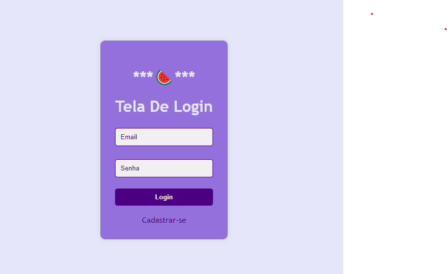

# Cadlog-system-Tela de login

Tarefa feita em sala,codigo que consiste em uma tela de acesso para um site interno, com páginas de cadastro e login. A autenticação do usuário é feita por um sistema seguro, que conecta o banco de dados ao front-end e passa por etapas de validação para garantir a segurança.

## 

## 

## metodos utilizados:
*vs code 
*google
*xammp
*git hub
## Autores
[Lara](https://github.com/laraassuncao18)
[Leo](https://github.com/LeonardoRochaMarista)