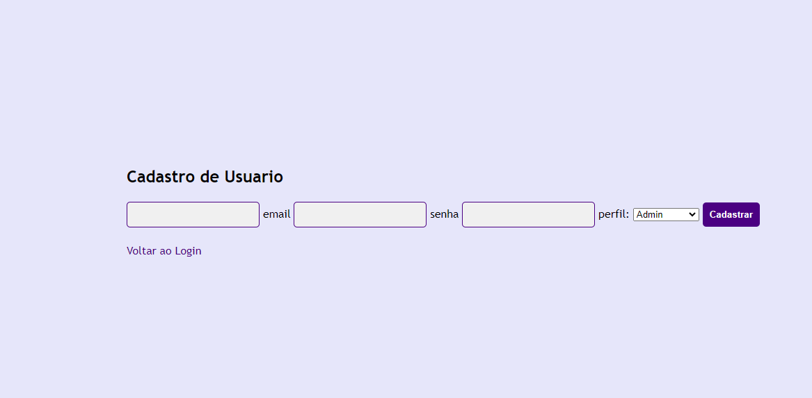

# Cadlog-system-Tela de login

Tarefa feita em sala,codigo que consiste em uma tela de acesso para um site interno, com páginas de cadastro e login. A autenticação do usuário é feita por um sistema seguro, que conecta o banco de dados ao front-end e passa por etapas de validação para garantir a segurança.

## 💟Página de Login (login.php):

* Formulário para entrada de email e senha.

## 💟Página de Cadastro (register.php):

* Formulário para registrar novos usuários com nome, email e senha.

* Inserção dos dados do novo usuário na tabela cadUser.

## 💟tecnologias utilizados:

* ``xampp``
* ``git hub``
* ``php``
* ``vs code``
* ``css``
* ``html``

## 

## Autores
[Lara](https://github.com/laraassuncao18)

[Professor Leo](https://github.com/LeonardoRochaMarista)
